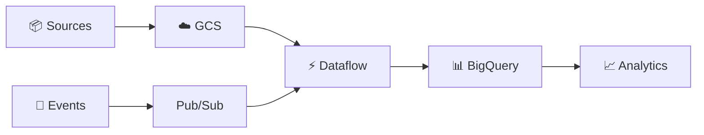

<div align="center">

# 👋 Hi, I'm Debarya Pal

### Senior Data Engineer • GCP • Big Data • Cloud Engineering

**Building scalable data platforms, reliable pipelines, and cloud-native analytics solutions.**


</div>

---

## 👨‍💻 About Me

I'm a **Senior Data Engineer** specializing in building scalable, reliable, and cost-efficient data platforms on **Google Cloud Platform**.

My work focuses on **large-scale data processing, ETL/ELT pipelines, batch & streaming architectures, data migration, data warehousing, performance optimization, and data quality**.

```text
☁️  Cloud        → Google Cloud Platform
⚡  Processing   → Dataflow • Dataproc • Spark • Apache Beam
🏗️  Engineering  → ETL/ELT • Batch • Streaming • Data Migration
🗄️  Warehouse    → BigQuery • Cloud SQL • PostgreSQL
🐍  Languages     → Python • SQL • PySpark
🔄  Orchestration → Cloud Composer • Apache Airflow
🚀  DevOps        → Git • GitHub • Jenkins • CI/CD • Terraform
```

---

## 🛠️ Tech Stack

### ☁️ Cloud & Data

<p>


</p>

### ⚡ Big Data

<p>


</p>

### 💻 Programming

<p>


</p>

### 🔄 DevOps & Orchestration

<p>


</p>

---

## 🚀 What I Do



I work across the complete data lifecycle:

**Ingestion → Transformation → Data Quality → Storage → Warehousing → Analytics**

My primary areas include:

* Large-scale **ETL/ELT pipeline development**
* **Batch & real-time streaming** architectures
* BigQuery warehouse design and optimization
* Apache Beam / Dataflow processing
* Spark & PySpark distributed processing
* Enterprise data migration
* Data reconciliation & quality validation
* Cloud Composer / Airflow orchestration
* CI/CD for data pipelines
* IAM & PII-aware data engineering
* Infrastructure as Code with Terraform

---

## 📊 Engineering Impact

<table>
<tr>
<td align="center">

### ⚡ ~40%

**Pipeline Throughput Improvement**

</td>
<td align="center">

### 💰 ~30%

**BigQuery Cost Reduction**

</td>
<td align="center">

### 🌏 10+

**International Markets**

</td>
<td align="center">

### 🔌 15+

**Data Sources**

</td>
</tr>
</table>

---

## 🏗️ Architecture I Work With

### Batch Data Pipeline

```text
Source Systems
      │
      ▼
Google Cloud Storage
      │
      ▼
Dataflow / Dataproc
      │
      ▼
BigQuery
      │
      ▼
Analytics / BI
```

### Real-Time Streaming Pipeline

```text
Applications / Events
         │
         ▼
      Pub/Sub
         │
         ▼
      Dataflow
         │
         ├────► Dead Letter Queue
         │
         ▼
      BigQuery
         │
         ▼
Real-Time Analytics
```

---

## 🧠 Data Engineering Expertise

| Area               | Technologies / Concepts                      |
| ------------------ | -------------------------------------------- |
| **Cloud**          | GCP                                          |
| **Data Warehouse** | BigQuery                                     |
| **Big Data**       | Spark, PySpark, Apache Beam, Dataproc        |
| **ETL / ELT**      | Dataflow, Python, SQL                        |
| **Streaming**      | Pub/Sub, Dataflow                            |
| **Orchestration**  | Airflow, Cloud Composer                      |
| **Storage**        | GCS, Cloud SQL, PostgreSQL                   |
| **Modeling**       | Star Schema, Snowflake, Fact & Dimension     |
| **Data History**   | SCD Type 1, SCD Type 2                       |
| **Optimization**   | Partitioning, Clustering, Query Optimization |
| **DevOps**         | Git, GitHub, Jenkins, CI/CD                  |
| **IaC**            | Terraform                                    |
| **Security**       | IAM, PII Protection, Encryption              |

---

## 🎯 Currently Exploring

```text
Multi-Cloud Data Architecture       █████████████████░░░
Advanced PySpark                    ██████████████████░░
Terraform / Infrastructure as Code ███████████████░░░░░
Generative AI + Data Engineering   ████████████████░░░░
RAG & AI Agents                    ██████████████░░░░░░
Lakehouse Architecture             █████████████████░░░
```

---

## 🔥 GitHub Contribution Streak

<div align="center">


</div>

> GitHub statistics widgets depend on third-party services and can occasionally be unavailable. For a production-quality profile, generating static stats through GitHub Actions is more reliable than depending entirely on public endpoints.

---

## 🐍 Contribution Activity

<div align="center">


</div>

---

## 💡 Engineering Philosophy

<div align="center">

### Build for Scale • Design for Failure • Optimize for Cost • Engineer for Reliability

</div>

```text
A good data pipeline should be:

✓ Scalable
✓ Reliable
✓ Idempotent
✓ Observable
✓ Secure
✓ Maintainable
✓ Cost Efficient
```

---

## 🤝 Let's Connect

<div align="center">

[](mailto:debarya.pal01@gmail.com)
[](https://github.com/DEBARYA76)

</div>

---

<div align="center">

### ☁️ Data Engineering • Big Data • Cloud Architecture

**Turning raw data into reliable, scalable and meaningful data products.**

</div>
